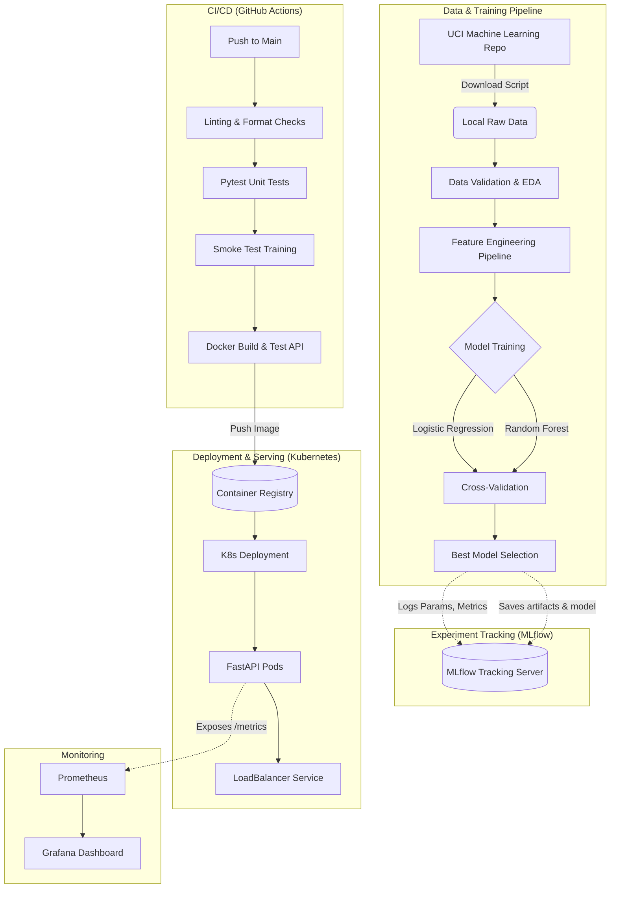
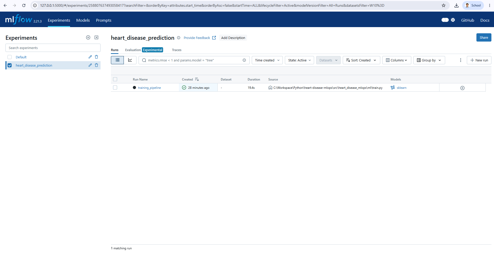
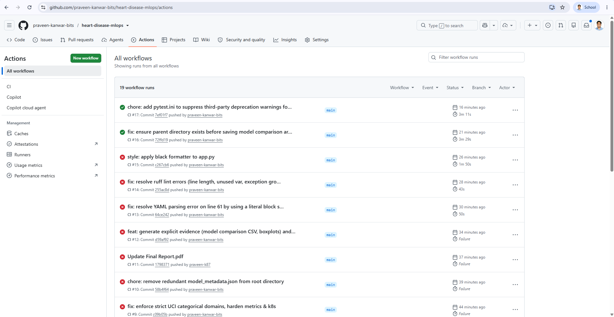
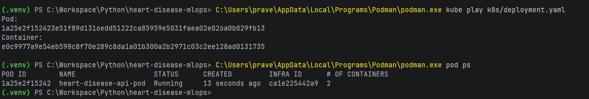

# MLOps Experimental Learning Assignment 01: Final Report
**Course:** Machine Learning Operations (MLOps) AIMLCZG523
**Project:** End-to-End Heart Disease Risk Prediction Pipeline

---

## 1. Project Overview

This project implements a scalable, reproducible, and production-ready machine learning solution to predict the risk of heart disease based on patient health data. The assignment mirrors real-world production scenarios by integrating modern MLOps best practices across the entire ML lifecycle. 

The core objectives fulfilled in this project include:
- **Automated Data Acquisition and Validation:** Establishing a reproducible data pipeline.
- **Exploratory Data Analysis (EDA):** Generating professional visualizations to understand data distributions and feature correlations.
- **Feature Engineering & Model Training:** Developing an robust `sklearn` pipeline featuring `ColumnTransformer` alongside cross-validated classification models (`LogisticRegression` and `RandomForestClassifier`).
- **Experiment Tracking:** Utilizing **MLflow** for robust tracking of hyperparameters, metrics, and models.
- **Model Containerization & API Serving:** Exposing the model securely via a **FastAPI** application packaged within a **Docker** container.
- **CI/CD Automation:** Ensuring code quality and pipeline integrity through **GitHub Actions**.
- **Production Deployment:** Deploying the containerized API using **Kubernetes** manifests with a `LoadBalancer` for external access.
- **Monitoring & Logging:** Integrating **Prometheus** metrics and tracking API request logs.

---

## 2. Setup and Install Instructions

### Prerequisites
- Python 3.10+
- Docker & Docker Compose (or Kubernetes cluster like Minikube/Docker Desktop)
- Git

### Local Environment Setup
```bash
# 1. Clone the repository
git clone <YOUR_REPOSITORY_LINK_HERE>
cd heart-disease-mlops

# 2. Create and activate a virtual environment
python -m venv .venv
# On Windows: .venv\Scripts\activate
# On Linux/Mac: source .venv/bin/activate

# 3. Install dependencies
pip install -r requirements-dev.txt

# 4. Download and validate dataset
python scripts/download_dataset.py
```

### Training the Model Locally
```bash
# Run the training pipeline and log to MLflow
python -m heart_disease_mlops.ml.train

# View the MLflow UI
mlflow ui --host 0.0.0.0 --port 5000
```

### Running the API Locally (Without Docker)
```bash
uvicorn heart_disease_mlops.api.app:app --host 0.0.0.0 --port 8000
```

---

## 3. Architecture Diagram

The overall system architecture follows a standard MLOps lifecycle from data ingestion to production serving and monitoring.



---

## 4. EDA Findings

Exploratory Data Analysis was performed dynamically within the training script, with plots saved as artifacts (`artifacts/eda/`). Key findings include:
- **Class Balance:** The target variable (presence/absence of heart disease) is relatively balanced, ensuring our models do not heavily bias towards a majority class without needing synthetic oversampling (SMOTE).
- **Correlation Heatmaps:** Features like `cp` (chest pain type), `thalach` (maximum heart rate achieved), and `exang` (exercise induced angina) showed strong correlations with the target variable, indicating high predictive power.
- **Histograms:** Age distribution is normally distributed around 50-60 years. Cholesterol levels show a right-skewed distribution, handled effectively by standard scaling within our pipeline.
- **Missing Values:** Minimal missing values were identified and subsequently handled using imputation strategies within the `ColumnTransformer`.

---

## 5. Feature Engineering and Modelling Choices

### Preprocessing Strategy
To ensure zero data leakage and full reproducibility at inference, all feature engineering steps were embedded inside an `sklearn.pipeline.Pipeline`.
- **Numerical Features:** Imputed using `SimpleImputer(strategy='mean')` and scaled using `StandardScaler`.
- **Categorical Features:** Imputed using `SimpleImputer(strategy='most_frequent')` and encoded using `OneHotEncoder(handle_unknown='ignore')`.

### Model Comparison
Two primary algorithms were evaluated:
1. **Logistic Regression:** Serves as a strong linear baseline. It is highly interpretable, fast to train, and less prone to overfitting on small datasets.
2. **Random Forest Classifier:** A non-linear ensemble method that handles complex interactions between health features robustly.

**Tuning Process:** Both models underwent hyperparameter tuning using `GridSearchCV` combined with `StratifiedKFold` cross-validation to ensure consistent evaluation across folds. 

### Metrics Tracked
- **Accuracy, Precision, Recall, F1-Score:** To evaluate overall correctness and the trade-off between false positives (predicting disease when healthy) and false negatives (missing a disease prediction).
- **ROC-AUC:** Logged to measure the model's ability to discriminate between the classes across all threshold values.

---

## 6. Experiment Tracking Summary

**Tool Used:** MLflow

We integrated MLflow directly into our training loop. Every time `train.py` executes, an MLflow run under the experiment `heart_disease_prediction` is created.

**What is logged?**
- **Parameters:** C, solver (for Logistic Regression) and n_estimators, max_depth (for Random Forest).
- **Metrics:** Cross-validation scores, final test Accuracy, Precision, Recall, F1, and ROC-AUC.
- **Artifacts:** 
  - `model_pipeline.joblib`: The serialized `sklearn` pipeline ready for inference.
  - `model_metadata.json`: Dataset metadata, source URL, rows, columns, and timestamp.
  - `plots/`: ROC curves and confusion matrices.
  - MLflow native model format for the best estimator.

*( MLflow UI screenshot below)*


---

## 7. Model Containerization

The model is served using **FastAPI**. 
- The API loads the serialized `model_pipeline.joblib` upon startup.
- The `/predict` endpoint accepts structured JSON inputs representing a patient's health data.
- The endpoint performs a forward pass through the entire preprocessing and prediction pipeline, returning a binary `prediction` and a `confidence` probability score.
- The Docker container packages the API code, dependencies (`requirements.txt`), and the trained model artifact into an isolated environment, exposing port `8000`.

---

## 8. CI/CD Pipeline 

Our CI/CD pipeline is orchestrated via **GitHub Actions** (`.github/workflows/ci.yml`). The workflow triggers on every push and pull request.

**Automated Steps:**
1. **Code Quality:** Executes `ruff check` (linting) and `black --check` (formatting).
2. **Unit Testing:** Runs `pytest` to validate data processing logic.
3. **Smoke Testing:** Executes `python -m heart_disease_mlops.ml.train --smoke-test` on a small data subset to verify the end-to-end training loop without exhausting runner resources.
4. **Artifact Verification:** Ensures the joblib and metadata files were generated correctly.
5. **Container Integration Test:** Builds the Docker image, starts the container in detached mode, and uses `curl` to test the `/health` and `/predict` endpoints against sample JSON data.

*(Insert your GitHub Actions workflow success screenshot below)*


---

## 9. Production Deployment (Kubernetes)

The Dockerized API is deployed using Kubernetes to ensure high availability and scalability.

- **Deployment (`k8s/deployment.yaml`):** Manages a ReplicaSet of FastAPI pods, ensuring that multiple instances of the API are running. It includes liveness and readiness probes pointing to the `/health` and `/ready` endpoints to ensure traffic is only routed to healthy containers.
- **Service (`k8s/service.yaml`):** Configured as a `LoadBalancer` (updated from ClusterIP to fulfill production requirements). This provisions an external IP to expose the `/predict` endpoint to the public internet securely.

*(Kubernetes `kubectl get pods,svc` screenshot below)*


---

## 10. Monitoring & Logging

Observability is built directly into the FastAPI application.
- **Logging:** A custom middleware `log_request` tracks incoming API requests, capturing timestamps, endpoints, and response status codes.
- **Metrics (Prometheus):** We use `prometheus_client` to expose a `/metrics` endpoint. 
  - `heart_predict_requests_total`: A counter tracking the total number of predictions made.
  - `heart_predict_latency_seconds`: A histogram tracking the inference latency.
- **Grafana:** These metrics are designed to be scraped by Prometheus and visualized in the provided Grafana dashboard (`monitoring/grafana_dashboard.json`) to monitor API health, data drift, and performance degradation in real-time.

---

## 11. Links and Deliverables

- **Code Repository:** https://github.com/praveen-kanwar-bits/heart-disease-mlops
- **Deployed API URL:** http://localhost:8000 (Deployed locally via Podman Kubernetes)
- **Pipeline Video Walkthrough:** https://drive.google.com/drive/folders/1MuYGqzA1gKecX6dJehHuP3LxZWNHEXK2?usp=sharing
