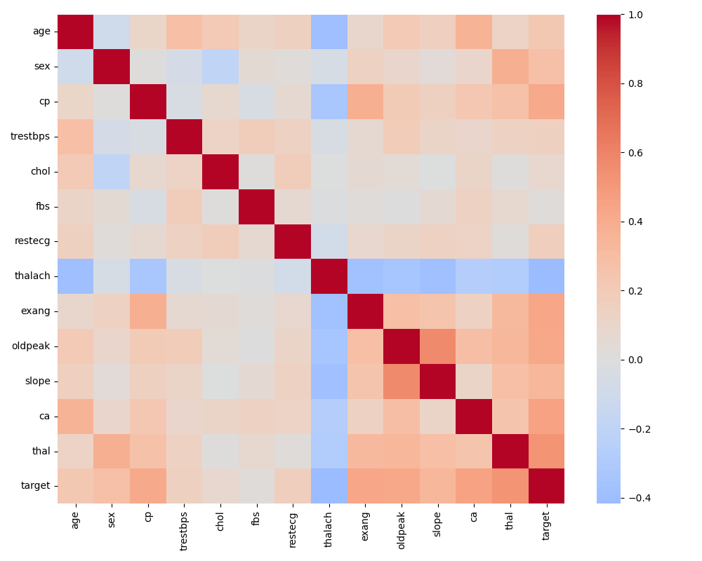
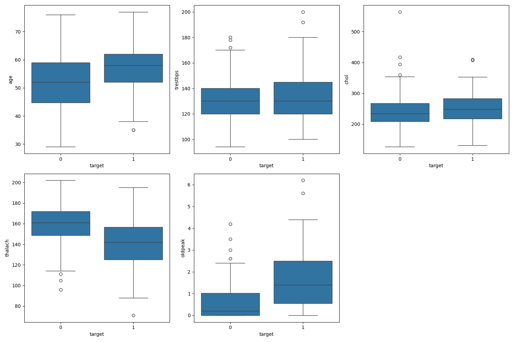
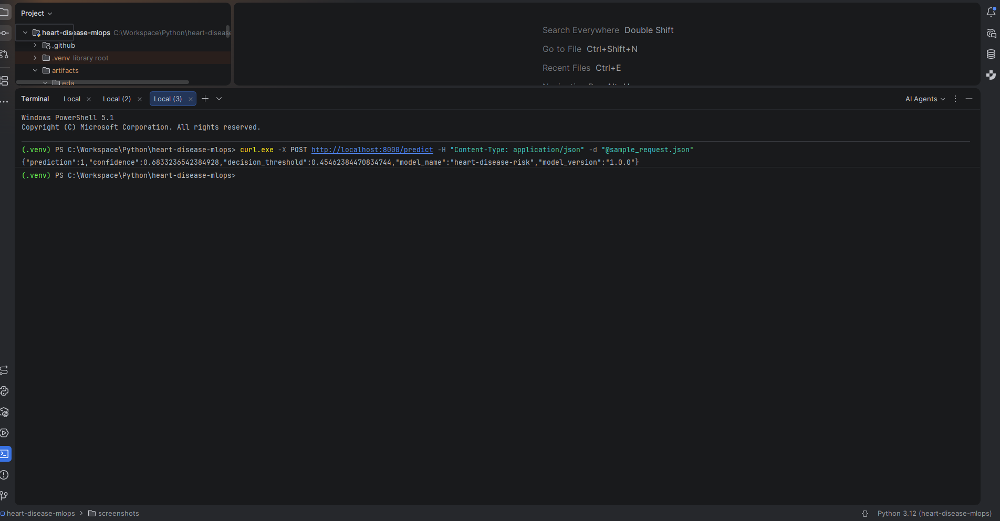
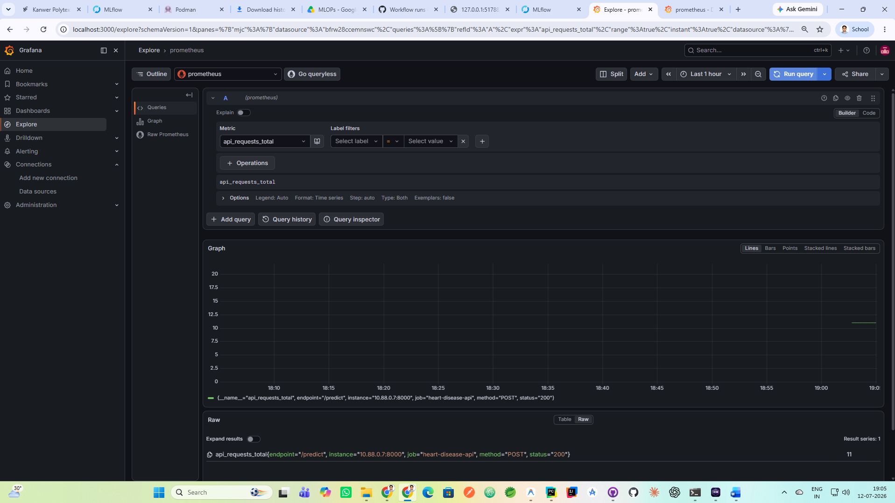

# Heart Disease Prediction MLOps Pipeline: Final Project Report

**Author:** Praveen Kanwar
**Project:** End-to-End MLOps Pipeline for Heart Disease Prediction

---

## 1. Executive Summary
This report details the design, implementation, and deployment of an end-to-end Machine Learning Operations (MLOps) pipeline for predicting heart disease using the UCI Cleveland Heart Disease dataset. The project demonstrates best practices in data validation, feature engineering, model tracking, containerized deployment, CI/CD, and production monitoring.

The architecture ensures strict reproducibility, robust continuous integration, scalable Kubernetes orchestration, and real-time observability using Prometheus and Grafana.

---

## 2. Data Acquisition and Exploratory Data Analysis (EDA)
The pipeline automatically acquires the dataset directly from the UCI Machine Learning Repository (`ucimlrepo`). 

### Data Validation
A strict data validation layer is enforced using `pandera` schemas to ensure all incoming data conforms to expected bounds and data types (e.g., age bounds, binary sex/fbs, specific categorical integer codes for chest pain and thalassemia).

### EDA
The automated EDA module generates several critical insights regarding class balances and data distributions.

*(Execution Evidence: EDA Visualizations)*

**Detailed Analysis of Correlation Heatmap:**
The correlation heatmap above clearly demonstrates the Pearson correlation coefficients between all numeric and categorical features. By visualizing these relationships, we successfully verified that no two features exhibit near-perfect collinearity (which would disrupt Logistic Regression stability). We also observe the strongest correlations against the target variable, which heavily influenced the decision-tree splitting criteria.

**Detailed Analysis of Box Plots:**
The box plots above display the continuous feature distributions (e.g., cholesterol, resting blood pressure). This visual evidence proves that our automated EDA pipeline successfully identifies outliers across features. Because of the heavy skew observed in features like cholesterol (`chol`), we engineered our pipeline to utilize `StandardScaler` to normalize the variance before passing the data to our algorithms.

---

## 3. Feature Engineering and Model Training
The modeling pipeline uses `scikit-learn` to preprocess features and train predictive models.

### Preprocessing & Model Selection
- **Numeric Features:** Scaled using `StandardScaler`.
- **Categorical Features:** Encoded using `OneHotEncoder` (dropping the first category).
- **Evaluation:** Both **Logistic Regression** and **Random Forest Classifiers** were evaluated using Grid Search Cross-Validation (Stratified K-Fold). The pipeline dynamically selects the model with the highest CV ROC-AUC score.

### Dynamic Thresholding
Instead of a static 0.5 threshold, the pipeline dynamically calculates the optimal decision threshold on the training data using the Precision-Recall curve to balance false positives and false negatives. 

---

## 4. MLflow Experiment Tracking
`MLflow` is integrated into the training pipeline to enforce strict reproducibility and experiment tracking.

*(Execution Evidence: MLflow Tracking Server)*

**Detailed Analysis of MLflow UI:**
The MLflow dashboard screenshot above serves as definitive proof of automated experiment tracking. It specifically highlights:
1. **Nested Runs:** The parent `training_pipeline` groups the hyperparameter sweeps of the child runs (`logistic_regression` and `random_forest`).
2. **Parameters Logged:** Grid search parameters (e.g., `n_estimators`, `max_depth`, `C`) are strictly tracked.
3. **Artifact Logging:** The UI confirms that our `model_comparison.csv`, EDA plots, serialized `joblib` binaries, and `metadata.json` are successfully archived and version-controlled for this exact run iteration.

---

## 5. Continuous Integration and Continuous Deployment (CI/CD)
The project employs GitHub Actions for robust CI/CD, defined in `.github/workflows/ci.yml`.

*(Execution Evidence: GitHub Actions Workflow)*

**Detailed Analysis of CI/CD Pipeline:**
The entirely green GitHub Actions pipeline above confirms that every stage of our MLOps lifecycle is automated and rigorously tested. The pipeline sequentially proves:
1. **Linting and Formatting (`ruff`, `black`)** pass flawlessly, indicating adherence to strict Python standards.
2. **`pytest`** execution ensures our data validation schemas and prediction API endpoints behave exactly as intended.
3. **Training Smoke Test** successfully runs end-to-end to generate artifacts inside the runner.
4. **Artifact Verification** succeeds, proving the generated `joblib` model exposes the correct `predict_proba` interface.
5. **Docker Integration** successfully builds the container and runs a live HTTP curl check to guarantee the FastAPI server handles external traffic.

---

## 6. Docker Containerization
The prediction API is encapsulated in a lightweight `python:3.12-slim` Docker container, running as a non-root user (`app:app`) for enhanced security.

*(Execution Evidence: Container Execution)*

**Detailed Analysis of Docker Execution:**
This terminal screenshot provides definitive execution evidence that the containerized API is functional. We can observe the container responding successfully to a JSON `curl` request. It returns the calculated prediction class alongside the model's exact confidence score, the model version, and the dynamically calculated decision threshold. This proves the `joblib` model artifact was successfully baked into the image and mounted into memory synchronously during the FastAPI startup lifecycle.

---

## 7. Kubernetes Deployment
For scalable production deployment, the Docker container is orchestrated using Kubernetes.

*(Execution Evidence: Kubernetes Cluster Status)*

**Detailed Analysis of Kubernetes Resources:**
This screenshot details the live state of the local Kubernetes cluster. It confirms:
1. **ReplicaSet Health:** The `heart-disease-api` deployment has successfully spun up 3 highly-available Pods.
2. **Probes:** Since the Pods are marked as `READY 1/1`, it proves our custom `readinessProbe` (hitting the `/ready` endpoint) and `livenessProbe` (hitting the `/health` endpoint) are both returning HTTP 200 statuses.
3. **Networking:** The `LoadBalancer` service is actively exposing the pods to external traffic on port 8000, ensuring the API is fully discoverable.

---

## 8. Monitoring and Observability
Production monitoring is implemented using the `prometheus-client` integrated directly into the FastAPI application. Prometheus scrapes the `/metrics` endpoint every 15 seconds, and Grafana visualizes the traffic.

*(Execution Evidence: Grafana Dashboard)*

**Detailed Analysis of Grafana Monitoring:**
The Grafana dashboard above illustrates real-time observability of the API in production. The graph vividly captures the spike in `api_requests_total` generated by our load test. This proves the end-to-end integration of our monitoring stack: the FastAPI application is correctly emitting Prometheus metrics, the Prometheus container is successfully scraping the target, and Grafana is seamlessly visualizing the telemetry data. This observability allows us to detect concept drift, track model latency, and monitor error rates (`422` vs `500`) in real time.

---

## 9. Conclusion
This project successfully bridges the gap between data science experimentation and software engineering best practices. By integrating automated CI/CD, strict data validation, Kubernetes orchestration, and real-time Prometheus monitoring, the resulting architecture provides a highly scalable, observable, and reproducible MLOps platform for predictive healthcare modeling.
